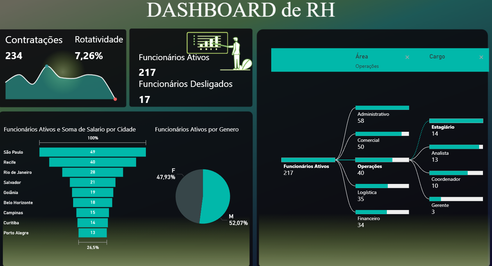

# Análise de Recursos Humanos RH

> Observação: os dados utilizados neste projeto são fictícios de estudo, com finalidade exclusivamente educacional e demonstrativa,
 O dashboard completo foi desenvolvido no Power BI Desktop.
 Prints foram utilizados devido à não publicação online do relatório. 

## 1. Problema de Negócio

A ausência de indicadores consolidados sobre quantidade total de funcionários, desligamentos, contratações, distribuição por gênero, localização geográfica, áreas e cargos e rotatividade dificulta o planejamento de pessoas, a tomada de decisões estratégicas e o controle de custos.

O principal desafio do negócio é entender como o quadro de funcionários evolui ao longo do tempo, onde estão concentrados os colaboradores, quais áreas possuem maior rotatividade e como os indicadores de RH impactam a sustentabilidade da organização.

## 2. Contexto

A empresa possui colaboradores distribuídos em diferentes estados do Brasil, áreas e cargos, além de um histórico de admissões e desligamentos ao longo dos anos.

A base de dados de RH contém informações como:

-funcionários ativoS E  desligados,

- gênero,

- estado (UF),

- área,

- cargo.

O objetivo deste projeto é transformar dados de RH em insights acionáveis, utilizando análises descritivas e visualizações claras, acessíveis tanto para RH quanto para a alta gestão.

## 3. Premissas da Análise

Para a realização da análise, foram adotadas as seguintes premissas:

- O total de funcionários considera todos os colaboradores que já passaram pela empresa.

- Funcionários ativos são aqueles sem data de desligamento.

- funcionários desligados são aqueles com desligamento registrada.

- A rotatividade (%) foi calculada com base na relação entre desligamentos e contratações.

- A análise de gênero considera as categorias Feminino (F) e Masculino (M).

## 4. Estratégia da Solução

A estratégia adotada seguiu uma abordagem estruturada de análise de dados:

### 4.1 Entendimento do problema de negócio

Definição dos principais indicadores de RH (KPIs de People Analytics).

### 4.2 Exploração e organização dos dados

Análise das colunas, padronização de categorias (gênero, estado, área e cargo) e tratamento de inconsistências.

### 4.3 Análise descritiva

Cálculo de métricas como:

- total de funcionários que já passaram pela empresa,

- total de funcionários ativos,

- total de funcionários desligados,

- total de contratações,

- taxa de rotatividade (%),

- distribuição por gênero,

- distribuição geográfica por estado,

- quantidade de funcionários por área e cargo.

### 4.4 Segmentação dos indicadores de RH

Avaliação dos dados por diferentes dimensões:

- gênero,

- estado,

- área,

- cargo,

### 4.5 Visualização dos dados

Criação de gráficos e indicadores claros para facilitar a interpretação e comunicação dos resultados com o negócio.

## 5. Insights da Análise

A análise dos dados permitiu identificar padrões relevantes, como:

- O total de funcionários ativos representa a maior parte do histórico de colaboradores da empresa.

- A quantidade de funcionários ativos entre os gêneros feminino e masculino.

- O volume de contratações acompanha o crescimento ou a reposição do quadro de funcionários.

Esses insights mostram que a dinâmica de pessoas não é aleatória, mas reflete padrões organizacionais que podem ser gerenciados estrategicamente.

  

## 6. Resultados

Como resultado do projeto, foram obtidos:

- Visão consolidada do histórico total de funcionários da empresa.

- Monitoramento claro do número de funcionários ativos e desligados.

- Análise da distribuição por gênero.

- Mapeamento geográfico dos funcionários ativos por estado do Brasil.

- A quantidade total de soma de salario de funcionários em um estado inteiro.

- Visão detalhada da alocação de pessoas por área e cargo.

- Cálculo e acompanhamento da taxa de rotatividade (%).

- Base analítica para apoiar decisões estratégicas de RH e gestão.

Além disso, o projeto demonstra como a análise de dados pode apoiar uma gestão de pessoas mais eficiente, mesmo utilizando análises e visualizações simples.

## 7. Próximos Passos

Com base nos resultados obtidos, os próximos passos recomendados são:

- Analisar a rotatividade por área, cargo e estado.

- Avaliar padrões de desligamento ao longo do tempo.

- Evoluir o dashboard com análises preditivas de rotatividade.

Este projeto representa um avanço importante para a gestão estratégica de pessoas, fortalecendo a cultura de People Analytics e apoiando decisões baseadas em dados.
